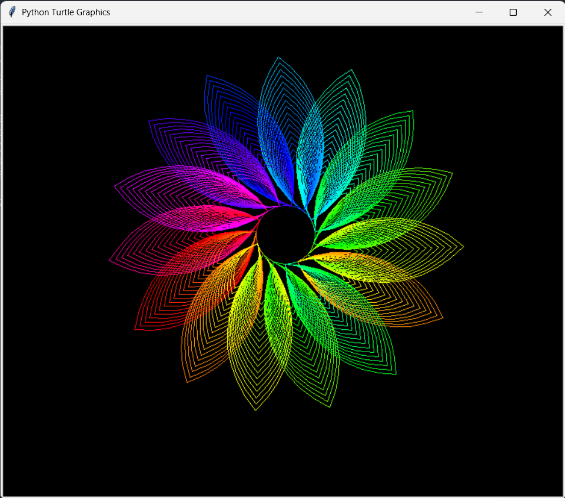

# Concentric Arc Pattern

A colorful generative art pattern created using Python's Turtle graphics and HSV color transitions. The design is formed by repeatedly drawing concentric quarter-circle arcs while gradually cycling through the color spectrum.

## Preview



## Requirements

* Python 3.x
* `turtle` (included with the standard Python installation)
* `colorsys` (Python standard library)

## Run

```bash
python concentric_arc_pattern.py
```

## How It Works

* Uses nested loops to draw multiple layers of concentric arcs.
* Gradually changes the drawing color using the HSV color model.
* Rotates the turtle after each iteration to produce radial symmetry.
* Combines circular arcs and incremental color changes to create a vibrant geometric pattern.

## Files

* `concentric_arc_pattern.py` — Source code.
* `concentric_arc_pattern.png` — Preview of the final artwork.

## License

This project is licensed under the MIT License.
